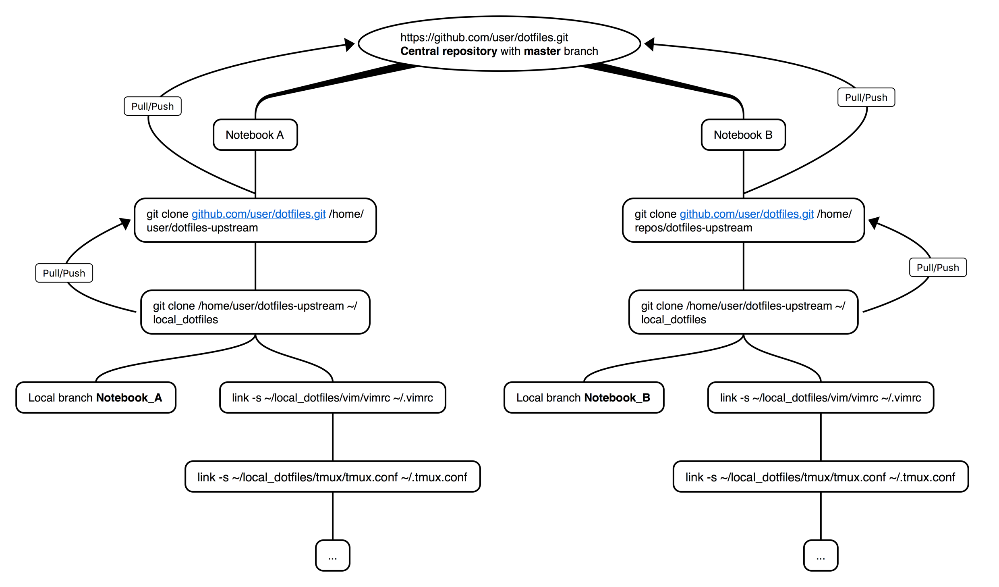

# dotfiles

Repository for my dotfiles.

## About

These files aim to be usable right out-of-the-box and one file for one application.
Note to myself: To use 3rd party custom logic or plugin systems like tpm for
`tmux` or pathogen for `vim`, these configurations are not included.

## Howto use this repository on multiple machines

## tmux color palette

